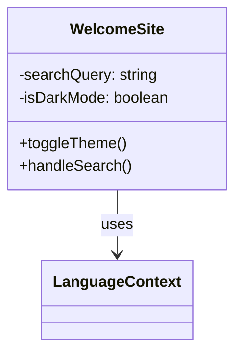

# Mermaid example

You can also use Mermaid (in Markdown) for quick diagrams.

Example:

```mermaid
classDiagram
  class WelcomeSite {
    -searchQuery: string
    -isDarkMode: boolean
    +toggleTheme()
    +handleSearch()
  }
  class LanguageContext
  WelcomeSite --> LanguageContext : uses
```

Open this file in a Mermaid-capable preview extension in VS Code to see the diagram.
